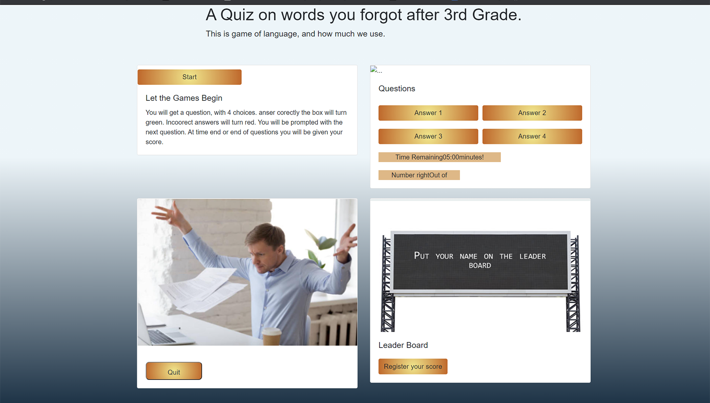

# **It's a Quiz**

## Not functional yet

###  Criteria  
. At start button
- timer starts counting down
- score sets to 0
-first question presented  

.if true increment score and repeat.  

.if false decrement time  and ask another question 

. Finish when either clock is 0 or no more questions  
-prompt for intials and write score to screen and memory.

